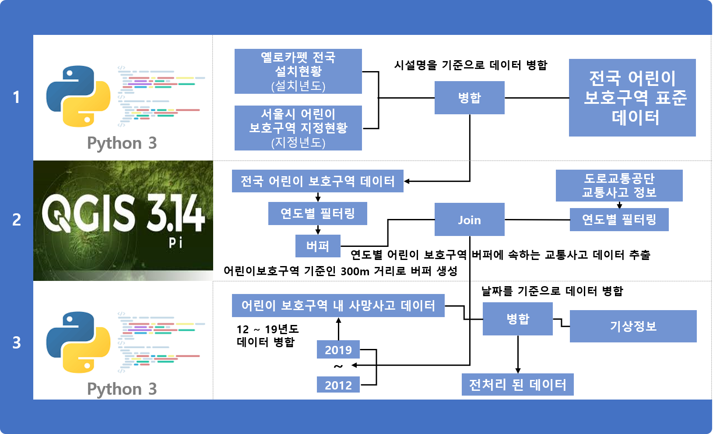

# 서울시 어린이보호구역 내 옐로카펫 효과성 검증
> ## 역할 ##
> - PM
> [김도민](https://github.com/DominKim?tab=repositories)
> - Researchers
> [박준영](https://github.com/parkjunyoung27), [배수혜](https://github.com/SuHae-Bae)
> - Analysts
> [강민경](https://github.com/kang260), [김지현](https://github.com/kjjh714), [신현영](https://github.com/oliviahs)
> - Proposal and preseentation writers
> [박윤설](https://github.com/YunseolPark), [김성민](https://github.com/qwe3965)
> - Presenter
> [박재민](https://github.com/JAM-PARK)
> ## 프로젝트 기획서 ##
>> [기획서](https://github.com/DominKim/Yellow_carpet_effectiveness_evaluation/blob/main/%EA%B3%BC%EC%A0%9C%EA%B0%9C%EC%9A%94%EC%84%9C/%EC%84%9C%EC%9A%B83%EB%B0%98_11%EC%A1%B0_%EA%B3%BC%EC%A0%9C%EA%B0%9C%EC%9A%94%EC%84%9C_%EC%B5%9C%EC%A2%85(20200917).hwp)
~~~ python3
한글파일로 작성
~~~
> ## 프로젝트 결과보고서 ##
>> [결과보고서(한글)](https://github.com/DominKim/Yellow_carpet_effectiveness_evaluation/blob/main/%EA%B2%B0%EA%B3%BC%EB%B3%B4%EA%B3%A0%EC%84%9C/(%EC%84%9C%EC%9A%B8-3%EB%B0%98-11%EC%A1%B0)%EA%B2%B0%EA%B3%BC%EB%B3%B4%EA%B3%A0%EC%84%9C_ppt%EC%9E%91%EC%84%B1_%EC%82%AC%EC%9A%A9.hwp)
>> [결과보고서(ppt)](https://github.com/DominKim/Yellow_carpet_effectiveness_evaluation/blob/main/%EA%B2%B0%EA%B3%BC%EB%B3%B4%EA%B3%A0%EC%84%9C/%EB%B0%9C%ED%91%9C_14.pptx)
> ## 분석 프로세스 ##
>> </img>
> ## 전처리 과정 ##
>> </img>
